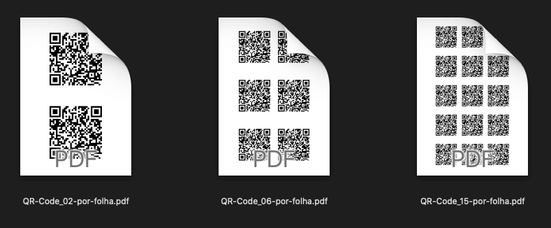
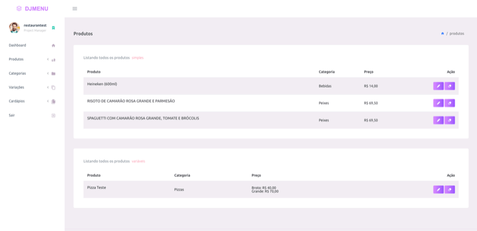
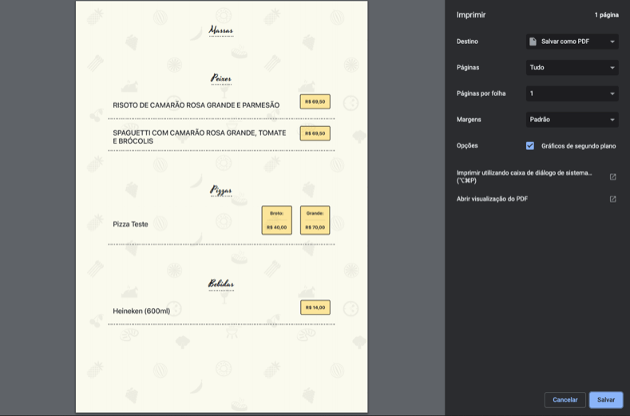

# goMenu
Multi-restaurant edition of DjangoMenu https://github.com/tiagocordeiro/djmenu


[](https://travis-ci.org/tiagocordeiro/gomenu)
[](https://pyup.io/repos/github/tiagocordeiro/gomenu/)
[](https://codecov.io/gh/tiagocordeiro/gomenu)

## Funcionalidades básicas

- [x] Crie cardápios que podem ser acessados via QRCode ou link.
- [x] Gere um PDF ou Imprima seu cardápio.
- [x] Pense antes de imprimir 🌳

Agora é possível ter vários restaurantes na mesma instalação, cada restaurante com seus produtos e cardápios.

## Live demo
[goMenu](https://gomenu.herokuapp.com/)

> Exemplos:
- [Lanches e Sucos 🍔 🥤](https://gomenu.herokuapp.com/menus/view/1/streetfruit/)
- [Pizza e Massas 🍕 🍝](https://gomenu.herokuapp.com/menus/view/3/vituccio/)
- [Cardápio com pedido 🧾 (em desenvolvimento 👩‍💻)](https://gomenu.herokuapp.com/menus/view/6/principal/)

> Imagens:








### Como rodar o projeto

* Clone esse repositório.
* Crie um virtualenv com Python 3.
* Ative o virtualenv.
* Instale as dependências.
* Rode as migrações.

```
git clone https://github.com/tiagocordeiro/gomenu.git
cd gomenu
python3 -m venv venv
source venv/bin/activate
pip install --upgrade pip
pip install -r requirements.txt
python contrib/env_gen.py
python manage.py migrate
```

### Configurar administrador
Para cria um usuário administrador
```
python manage.py createsuperuser --username dev --email dev@foo.bar
```

### Rodar em ambiente de desenvolvimento
Para rodar o projeto localmente
```
python manage.py runserver
```

### Banco de dados para ambiente de desenvolvimento com Docker
```
docker-compose up -d
```

### Como fazer deploy na Heroku
Nesse vídeo é demonstrado como fazer o deploy na Heroku utilizando:

* `Cloudinary` para os arquivos estáticos e de mídia.
* `Sentry` para monitorar bugs e erros na aplicação.

[](https://www.youtube.com/watch?v=l5bmooWfrKM)

[Abrir no YouTube](https://www.youtube.com/watch?v=kDIaaqyIWU4 "Abrir no YouTube")

### Thanx
- [[ ~ PurpleAdmin Free Admin Template ~ ]](https://github.com/BootstrapDash/PurpleAdmin-Free-Admin-Template)
- [[ ~ Dependencies scanned by PyUp.io ~ ]](https://pyup.io/)
